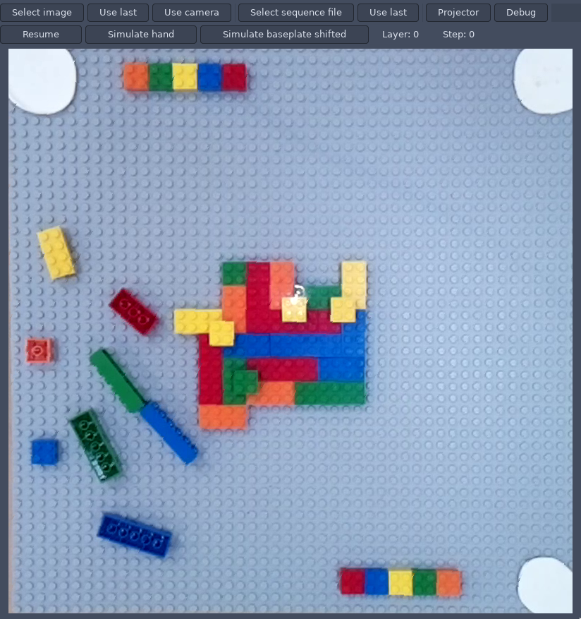
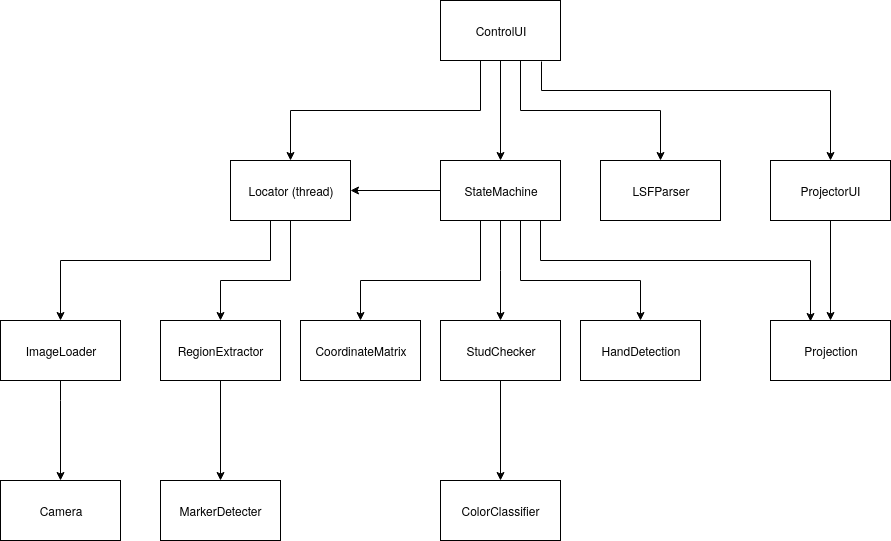
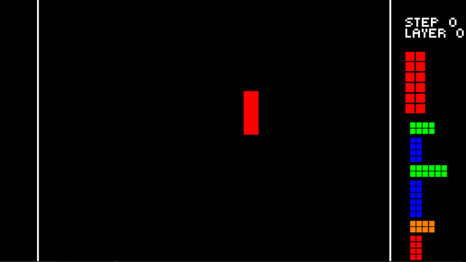

---
title:
- Augmented Reality Assembly Support System
authors:
- Casper Uiterwijk
- Nick Vivirito
- Andreas Stratakis
theme:
- Copenhagen
---

# Contents

- Demo
- What was done in Phase 2
- Rewrite to C/C++
- Comparison
- Testing
- Project conclusion

# What was done in Phase 2

- Rewrite to C/C++
- Projection UI
- Hand detection
- Automatic calibration

\ \ \ \ \ \ \ \ \ \ \ \ \ \ \ \ \ \ \ \ \ \ \ \ \ \ \ \ \ \ \ \ \ \ \ \ \ \ \ \ \ \ \ \ \ \ \ \ 
{ height=180px }

# Rewrite to C and C++

- C++ platform (CMake, GTKmm)
- Operators in C
  - Marker detection
  - Affine warp
  - Erosion
  - Drawing functions
- UI development

\ \ \ \ \ \ \ \ \ \ \ \ \ \ \ \ \ \ \ \ \ \ \ \ \ \ \ \ \ \ \ \ \ \ \ \ \ \ \ \ \ \ \ \ 
{ height=130px }

# Comparison

- Program does not crash
- Colour detection is more robust
- Baseplate has to be in a more specific position
- User interface is much improved

\ 

\ \ \ \ \ \ \ \ \ \ \ \ \ \ \ \ \ \ \ \ \ \ \ \ \ \ \ \ \ \ \ \ \ \ \ \ \ \ \ \ \ \ \ \ \ \ 
{ height=150px }

# Testing

- Functional tests
- Unit tests

# Project conclusion

- Is it a convincing proof-of-concept?
- Was it a viable project for the Vision minor?

# Next steps

- Automate parts of the user interface
- (difficult) Implement automatic projector calibration
- (difficult) Support pieces other than standard LEGOs

# Questions?

- Software challenges
- Hardware challenges
- Goals
